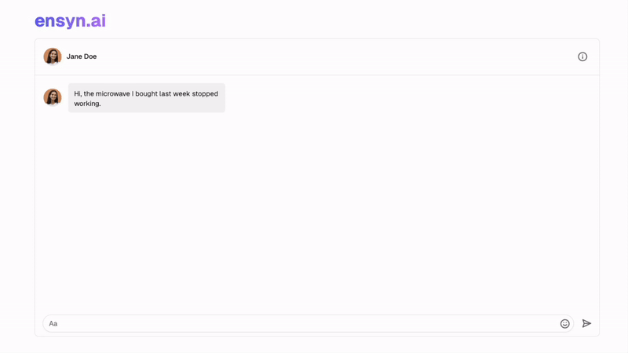
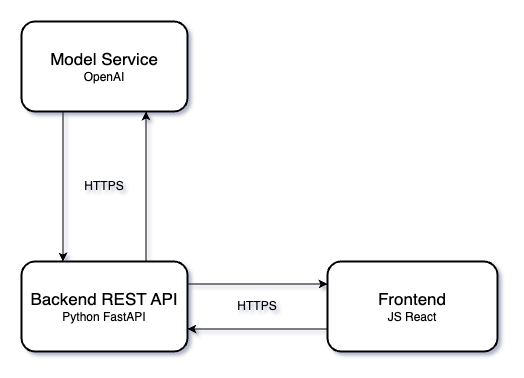

# Customer Service AI Trainer

This project is an AI-based platform for training Customer Service agents. The entire app is AI-powered and uses the OpenAI API to generate both responses to customer queries and provide feedback to the agents. The platform is built using FastAPI and ReactJS and is containerized using Docker.

<p align="center">
  
</p>


The project code can be accessed in the `backend-app` and `frontend-app` directories. See the directory structure below:

```
├── docs
├── backend-app
├── frontend-app
└── docker-compose.yml
```

## Technologies


## System Diagram

<p align="center">
  
</p>


## Setting up the environment

### Prerequisites

Ensure you have `Docker` installed on your machine. If not, you can download it [here](https://docs.docker.com/get-docker/).

### Clone the app

```sh
$ git clone --recurse-submodules -b demo https://github.com/ensynAI/customer-service-ai-trainer.git
```

### Environment variables

Create a `.env` file containing your OpenAI API Key in the root directory (devops).

`.env` file structure:

```
OPENAI_API_KEY="your-api-key"
```

## Running the app

To launch the app run the following command. The command builds the docker images and launches the app (this may take some time).

```sh
$ docker-compose up
```

To rebuild everything from scratch use:

```sh
$ docker-compose up --build --force-recreate --no-deps
```

## Running the app

To use the app go to [localhost:3000](http://localhost:3000/)

- Fronend app: [localhost:3000](http://localhost:3000/)

- Backend server: [localhost:8000](http://localhost:8000/)
